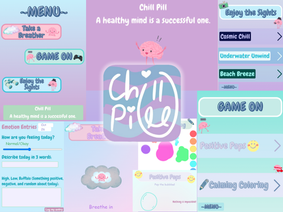

 
  

<b>Chill Pill</b> is a mindfulness app designed to help teens and students reduce stress and anxiety.  
It encourages reflection, relaxation, and creativity through interactive features that promote mental well-being.

---

# Inspo ✌️

As a teen, I saw how stress from school and activities impacts mental health. Chill Pill was created as a small step toward mindfulness and supporting healthier, happier lives.  

---
# Features ✨

- Reflection Tools: Daily entry prompts  
- Relaxation Exercise/Game/Environment: Created for user enjoyment  
- Simple & Friendly UI: Clean design for easy navigation  
- Lightweight: Runs smoothly in Code.org’s App Lab environment  

---

# Launch the App 🚀

Chill Pill is fairly easy to use. It was made with JavaScript in Code.org's App Lab and is orginally intended to be used and run through Code.org's App Lab.  
Tap on the Chill Pill icon to open the app once in Code.org's App Lab preview. Use: https://studio.code.org/projects/applab/-F1kH1rnR3S6-FzsDKykZTtk0aNhVlmvci4sdb35mUw  
 
---

# App Walk Through 😎

<b>😊Emotion Entries.</b>
>Start by logging your mood by using a slider and text reflection.  
>This daily entry unlocks all other features.  

### There are three options from here.   
<b>😌Take a Breather</b>  
>There's not much digital interaction here.  
>Users are guided through a visual breathing excerise.  

<b>🎮Game On</b>  
>Two Options- 
>Postitive Pops (includes sound): Tap on to pop bubbles revealing positive affirmations.  
>Calming Coloring: Draw with 8 colors, adjust brush size with a slider, and use an eraser. (hold down and drag the mouse)  

<b>📷Enjoy the Sights</b>  
>There are three scenes to choose from.  
>These require no digital interaction, but includes sound. Users can sit back and relax as they watch a cute animation and listen to soft music.  
>Cosmic Chill: Space themed (stars & planets).  
>Underwater Unwind: Underwater themed (fish & jellyfish).  
>Beach Breeze: Beach themed (crab, shells, & waves).  

---

# Built With 🛠️
JavaScript in Code.org App Lab

---

# Credits 🙌
Developed for the <b>Congressional App Challenge 2025 </b>   
Graphics from Canva or hand-drawn by: KatyL43  
Fonts & text made on Canva  

---

# License 📜
This project is licensed under the MIT License – see the LICENSE file for details.   
